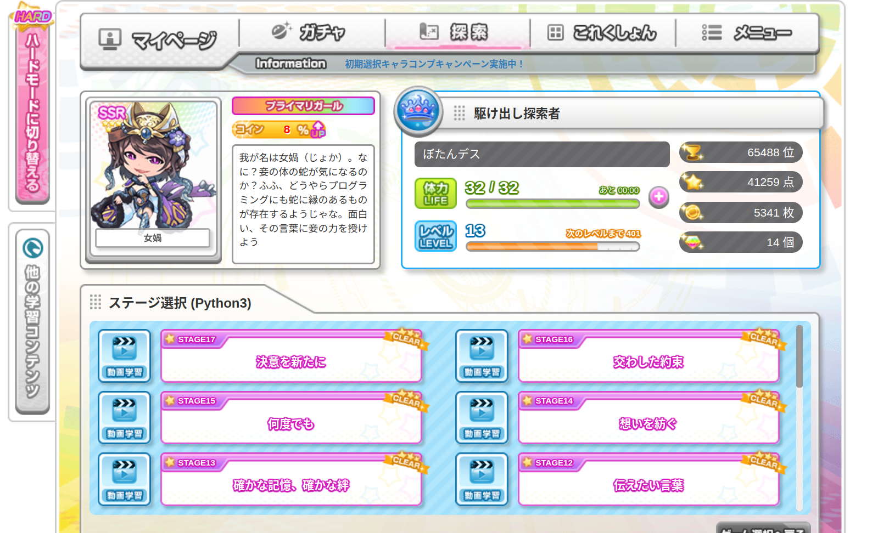

# paiza

##code girl collection

# src_恋するハッカソン

[ショートヘア](src/shorthair.py)

[ロングヘア](src/longhair.py)

[ポニーテール](src/ponytail.py)

[ツインテール](src/twintail.py)

[おさげ](src/osage.py)

[タレ目](src/tareme.py)

[つりめ](src/tsurime.py)

[メガネ](src/megane.py)

[キュート衣装](src/cute-isyo.py)

[Sexy衣装](src/sexy-isyo.py)

[水着](src/mizugi.py)

[マイク](src/microphone.py)

[カチューシャ](src/katyusya.py)

#src2_彼女を作る

[つり目](src2/tsurime.py)

[眼帯](src2/gantai.py)

[猫耳セット](src2/nekomimi-set.py)

[猫セット](src2/neko-set.py)

[ショートヘア](src2/shorthair.py)

[ロングヘア](src2/longhair.py)

[ポニーテール](src2/ponytail.py)

[ツインテール](src2/twintail.py)

[セーラー服](src2/sailor-suit.py)

[カーディガン](src2/cardigan.py)

[しまニーソセット](src2/shima-socks.py)

[メイド服](src2/maid-fuku.py)
